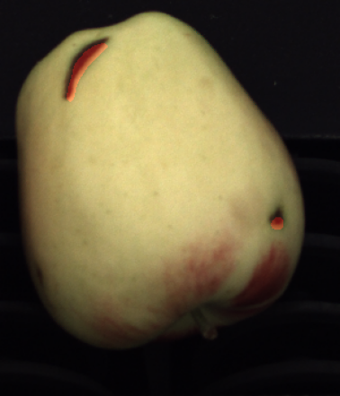
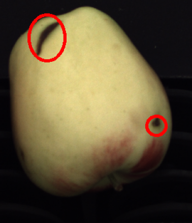
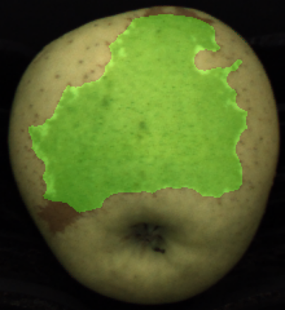
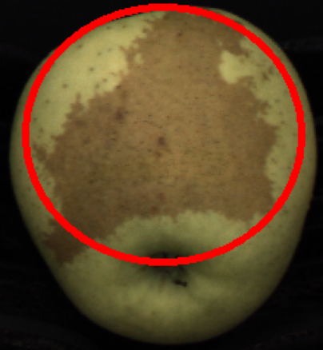
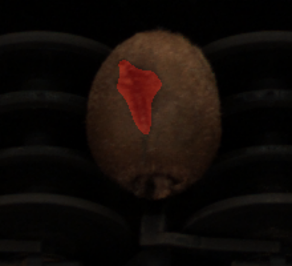
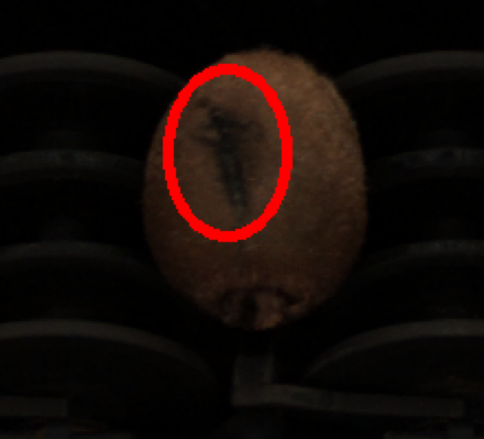

# :apple: 🥝 Fruit Inspection :mag:
The use of modern *Image Processing* and *Computer Vision* techniques is widely spread in the fruit supply chain as a way of guaranteeing quality and homogeneity of the final product to the end-users, whilst reducing both production costs and times.

The present project, describes the implementation of an intelligent system capable of detecting imperfections and defects in fruits. Each fruit is acquired through a *NIR (Near Infra-Red)* and colour camera with little parallax effect.

<div align="center">

  | NIR example                             | Colour example                         |
  |:---------------------------------------:|:--------------------------------------:|
  |   |  |

</div>

* For an in-depth description of the problem, read the [assignment](assignment.pdf) document.
* For an in-depth description of the solution to the problem, read the [report](report.pdf) document.
* For a visualization of the process to build the systems, see the notebooks:
  * [First task](src/First%20task.ipynb)
  * [Second task](src/Second%20task.ipynb)
  * [Final challenge](src/Final%20challenge.ipynb)

## Description
The project includes three distinct tasks. In each of them a group of different colour images of fruits, along with their respective NIR version, is presented. The following requirements are expected to be achieved:

* **First Task: Fruit Segmentation and Defect Detection.** Three images of apples are presented. The goal is to segment them from the background and locate imperfections caused by holes on their skin;
* **Second Task: Russet Detection.** Two images of apples with unwanted reddish-brown parts (referred as russets) are observed. The aim is to identify these areas in the most precise way as possible;
* **Final Challenge: Kiwi Inspection.** It is required to analyse five images of kiwis in order to locate their defects. Extra effort is required to pre-process them because of a great amount of noisy artefacts in the background of some of the given images.

## Interface

Three main scripts are provided to the user in order to test the defect detection systems.

### Execute first task
The [execute first task script](src/execute_first_task.py), provides a command line script to execute the task of detecting the defects of a fruit. It firstly masks the fruit, then it looks for the defects. If the task is run in `verbose` mode, the visualization of the defect regions of the fruit is plotted.

The script positional arguments are:
* `fruit-image-path`: The path of the colour image of the fruit.
* `fruit-nir-image-path`: The path of the Near Infra-Red image of the fruit.
* `image-name` (optional): The name of the image.

The following optional non positional arguments are present:
* `--tweak-factor`, `-tf` (default=0.3): Tweak factor for obtaining the binary mask.
* `--sigma`, `-s` (default=1): Sigma to apply to the Gaussian Blur operation before Canny's algorithm.
* `--threshold-1`, `-t1` (default=60): First threshold that is used in Canny's algorithm hysteresis process.
* `--threshold-2`, `-t2` (default=120): Second threshold that is used in Canny's algorithm hysteresis process.
* `--no-verbose`, `-nv` (default=False); Skip the visualization of the results.

It returns:
* Number of defect regions found in the fruit
* Array of statistics about each defect region:
  - The leftmost (x) coordinate which is the inclusive start of the bounding box in the horizontal direction;
  - The topmost (y) coordinate which is the inclusive start of the bounding box in the vertical direction;
  - The horizontal size of the bounding box;
  - The vertical size of the bounding box;
  - The total area (in pixels) of the defect.
* Array of centroid points about each defect region.

### Execute second task
The [execute second task script](src/execute_second_task.py), provides a command line script to execute the task of detecting the russet regions of a fruit.
It firstly detects the class of the fruit, then it looks for the russet regions that can be present according to the class of the fruit. If the task is run in `verbose` mode, then the procedure of the detection of the fruit class is plotted along with the visualization of the russet regions in the fruit.

The script positional arguments are:
* `fruit-image-path`: The path of the colour image of the fruit.
* `image-name` (optional): The name of the image.

The following optional non positional arguments are present:
* `--config-file-path`, `-cf`: The path of the configuration file.
* `--data-folder-path`, `-d`: The path of the data folder.
* `--tweak-factor`, `-tf` (default=0.4): Tweak factor for obtaining the binary mask.
* `--class-threshold`, `-ct` (default=3): Distance threshold to compute the class of the fruit.
* `--no-verbose`, `-nv` (default=False); Skip the visualization of the results.

It returns:
* Number of russet regions found in the fruit
* Array of statistics about each russet region:
  - The leftmost (x) coordinate which is the inclusive start of the bounding box in the horizontal direction;
  - The topmost (y) coordinate which is the inclusive start of the bounding box in the vertical direction;
  - The horizontal size of the bounding box;
  - The vertical size of the bounding box;
  - The total area (in pixels) of the russet.
* Array of centroid points about each russet region.

### Execute final challenge
The [execute final challenge script](src/execute_final_challenge.py), provides a command line script to execute the task of detecting the defects of a fruit in a very noisy environment. It firstly masks the fruit, then it looks for the defects. If the task is run in `verbose` mode, the visualization of the defect regions of the fruit is plotted.


The script positional arguments are:
* `fruit-image-path`: The path of the colour image of the fruit.
* `fruit-nir-image-path`: The path of the Near Infra-Red image of the fruit.
* `image-name` (optional): The name of the image.

The following optional non positional arguments are present:
* `--tweak-factor`, `-tf` (default=0.4): Tweak factor for obtaining the binary mask.
* `--sigma`, `-s` (default=1): Sigma to apply to the Gaussian Blur operation before Canny's algorithm.
* `--threshold-1`, `-t1` (default=50): First threshold that is used in Canny's algorithm hysteresis process.
* `--threshold-2`, `-t2` (default=85): Second threshold that is used in Canny's algorithm hysteresis process.
* `--mean-file-path`, `-m`: The path of the mean file of the colour of the kiwi region.
* `--inv-cov-file-path`, `-inv-cov`: The path of the inverse covariance matrix file of the colour of the kiwi region.
* `--roi-threshold`, `-t` (default=10): Distance threshold to segment the fruit from the sticker.
* `--no-verbose`, `-nv` (default=False); Skip the visualization of the results.

It returns:
* Number of defect regions found in the fruit
* Array of statistics about each defect region:
  - The leftmost (x) coordinate which is the inclusive start of the bounding box in the horizontal direction;
  - The topmost (y) coordinate which is the inclusive start of the bounding box in the vertical direction;
  - The horizontal size of the bounding box;
  - The vertical size of the bounding box;
  - The total area (in pixels) of the defect.
* Array of centroid points about each defect region.


## Usage

### Execute first task
The following shell command executes the defect detection system built for the first task on image `000001`.
```sh
python src/execute_first_task.py "images/first task/C1_000001.png" "images/first task/C0_000001.png" "image 1"
```

<div align="center">

  | Detected defects                                    | Detected defect areas                                  |
  |:---------------------------------------------------:|:------------------------------------------------------:|
  |    |  |

</div>


### Execute second task
The following shell command executes the russet detection system built for the second task on image `000005`
```sh
 python src/execute_second_task.py "images/second task/C1_000005.png" "image 5"
```

<div align="center">

  | Detected russets                                    | Detected russet areas                                  |
  |:---------------------------------------------------:|:------------------------------------------------------:|
  |    |  |

</div>


### Execute final challenge
The following shell command executes the defect detection system built for the final challenge on image `000007`.
```sh
 python src/execute_final_challenge.py "images/final challenge/C1_000007.png" "images/final challenge/C0_000007.png" "image 7"
```

<div align="center">

  | Detected defects                                    | Detected defect areas                                  |
  |:---------------------------------------------------:|:------------------------------------------------------:|
  |    |  |

</div>

## Repository structure

    .
    ├── images                              # Directory containing source Images of the fruits of which the defects have to be identified.
    │   ├── extra
    │   ├── final challenge
    │   ├── first task
    │   └── second task
    ├── src
    │   ├── config                      
    │   │   └──  config.json                # Configuration JSON file that expresses the paths of files useful for the second task.
    │   ├── data                            # Directory contining useful data files for the various tasks.
    │   ├── utils
    │   │   ├── __init__.py
    │   │   ├── colour.py                   # Python module about colour related functions.
    │   │   ├── colour_threshold.py         # Python module about colour thresholding and segmentation functions.
    │   │   ├── edge.py                     # Python module about edge detection functions.
    │   │   ├── general.py                  # Python module about general plotting and image transformation functions.
    │   │   └── threshold.py                # Python module about thresholding and segmentation functions.
    │   ├── Final challenge.ipynb           # Notebook describing the process to solve the final challenge.
    │   ├── First task.ipynb                # Notebook describing the process to solve the first task.
    │   ├── Second task.ipynb               # Notebook describing the process to solve the second task.
    │   ├── execute_final_challenge.py      # Script to execute the system built to detect the defects in the final challenge.
    │   ├── execute_first_task.py           # Script to execute the system built to detect the defects in the first task.
    │   └── execute_second_task.py          # Script to execute the system built to detect the defects in the second task.
    ├── assignment.pdf                      # Assignment of the project
    ├── .gitattributes
    ├── .gitignore
    ├── LICENSE
    ├── report.pdf                          # Report of the project
    └── README.md

## Dependencies
- [OpenCV](https://pypi.org/project/opencv-python/)
- [Matplotlib](https://matplotlib.org/)
- [NumPy](https://numpy.org/)
- [SciPy](https://scipy.org/)
- [scikit-learn](https://scikit-learn.org/stable/)

## Versioning

Git is used for versioning.

## Group members
<div align="center">

  |  Name           |  Surname  |     Email                           |    Username                                             |
  | :-------------: | :-------: | :---------------------------------: | :-----------------------------------------------------: |
  | Facundo Nicolas | Maidana   | `facundo.maidana@studio.unibo.it`   | [_maidacundo_](https://github.com/maidacundo)           |
  | Riccardo        | Spolaor   | `riccardo.spolaor@studio.unibo.it`  | [_RiccardoSpolaor_](https://github.com/RiccardoSpolaor) |

</div>

## License

This project is licensed under the MIT License - see the [LICENSE](LICENSE) file for details.
